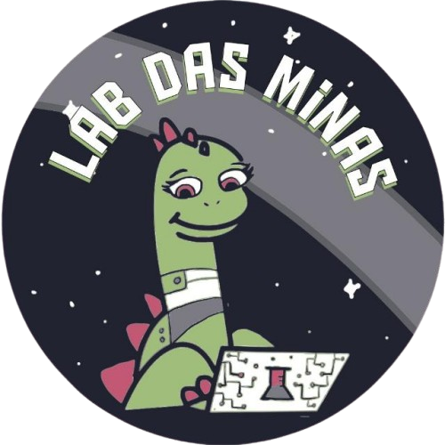

<div align="center">
    


<h1> Site do Lab das Minas </h1>

[](https://labdasminas.github.io/)

O **Lab das Minas** é um projeto de pesquisa e extensão da EACH-USP com o foco na inserção de mulheres na Ciência e Tecnologia por meio de oficinas com meninas do ensino fundamental.


</div>


<br/><br/>


## 🖱️ Tecnologias

<div align="center">


</div>
<br/><br/>


## 🚀 Inicie com o projeto

### 📦 Instalação

Requisitos: 
- Node.js 18.18 ou versões mais atuais
- Git

```bash
git clone git@github.com:petsi-each/bxcomp2024-site.git
cd bxcomp2024-site
npm i
```

<br/>

### ⚙️ Execução

- Modo de produção:
```
npm run build
```


- Modo de desenvolvimento:
```
npm run dev
```
O projeto estará rodando localmente no link que aparece no terminal. Geralmente, será http://localhost:3000

<br/><br/>

## 🫂 Contribuidores

<a href = "https://github.com/LabDasMinas/labdasminas.github.io/contributors">
  
</a>
